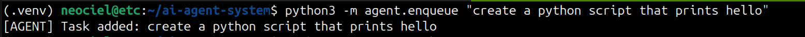
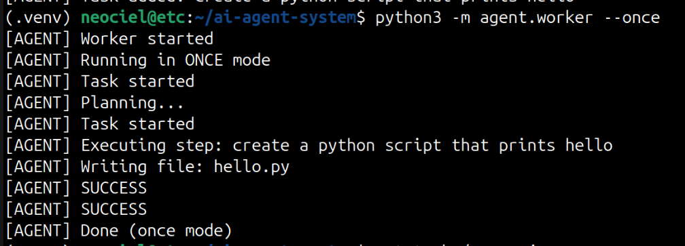
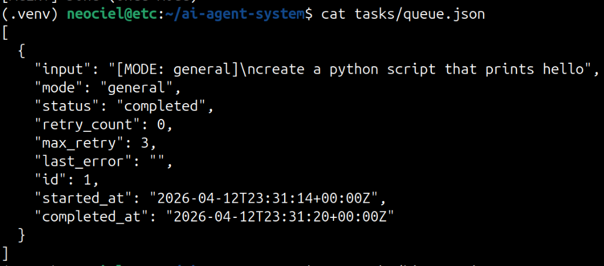
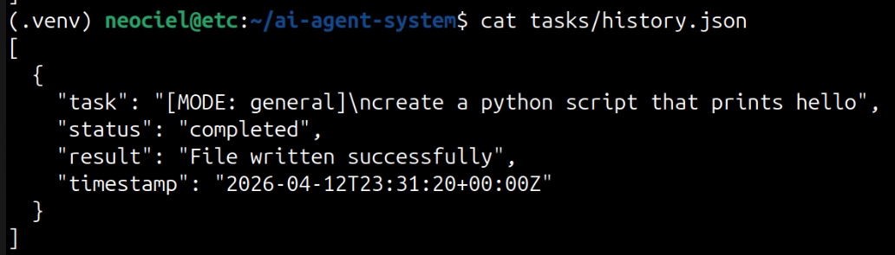
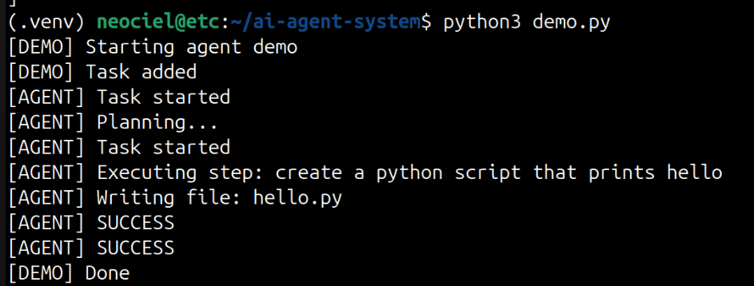

# 🚀 Autonomous AI Agent

> An autonomous LLM-powered execution system that can plan tasks, use tools, evaluate outcomes, and retry failures without human intervention.

## Why this project matters

Most AI agent projects stop at chat-based orchestration.

This project implements a more complete execution architecture:

- A planner converts a task into minimal action-level steps
- A ReAct-style agent loop executes those steps with system tools
- A worker processes tasks from a persistent queue
- An evaluator verifies outcomes and triggers retries when needed
- Queue state, history, and logs make execution traceable across runs

This is not just a prompt wrapper. It is a small but real agent runtime.

## System Architecture

`User -> CLI -> JSON Queue -> Worker -> Planner -> Agent Loop -> Tools -> Evaluator -> History / Logs`

### Core components

- `agent/enqueue.py` accepts tasks and stores them with mode, status, and retry metadata
- `agent/worker.py` pulls pending jobs, runs them, updates status, and writes execution history
- `agent/planner.py` generates a constrained step-by-step plan for the task
- `agent/agent_loop.py` runs the ReAct loop: `Thought -> Action -> Observation`
- `agent/tools/` provides shell, file, and Python execution
- `agent/evaluator.py` checks whether execution actually succeeded
- `agent/safety.py` applies basic guardrails to shell and Python actions

### Execution model

1. A task is enqueued through the CLI.
2. The worker loads the next pending task from persistent storage.
3. The planner generates a minimal plan.
4. The agent executes each step using tools.
5. The evaluator decides whether the result is acceptable.
6. Failures are retried with updated context until success or max attempts.
7. Final state is written to queue, history, and log files.

## Core Capabilities

- ReAct-based task execution with explicit tool actions
- Persistent JSON-backed queue for autonomous processing
- Worker mode for one-shot or continuous execution
- Self-debugging retry loop with evaluation feedback
- Execution history and timestamped logs for traceability
- Task modes for general, coder, tester, and planner workflows
- Safety layer for command and Python execution filtering

## Demo

### CLI Input



### Agent Execution



### Queue State



### Task History



### Full Demo



## Example Task

**Enqueue**

```bash
python3 -m agent.enqueue "create a python script that prints hello"
```

**Execute once**

```bash
python3 -m agent.worker --once
```

**Outcome**

- Creates `hello.py`
- Executes the task through the worker pipeline
- Stores status and result in `tasks/queue.json` and `tasks/history.json`

## Usage

### Prerequisites

- Python 3.12+
- `OPENAI_API_KEY` set in the environment
- OpenAI Python SDK available in the environment

### Add a task

```bash
python3 -m agent.enqueue "your task"
```

### Add a task in a specific mode

```bash
python3 -m agent.enqueue --mode coder "create a calculator script"
```

### Run the worker once

```bash
python3 -m agent.worker --once
```

### Run the worker continuously

```bash
python3 -m agent.worker
```

### Run the demo

```bash
python3 demo.py
```

## Project Structure

```text
agent/
  agent_loop.py    # ReAct execution engine
  planner.py       # task planning and replanning
  evaluator.py     # success/failure evaluation
  worker.py        # autonomous queue processor
  queue.py         # persistent task storage
  safety.py        # execution guardrails
  tools/           # shell, file, python tools
tasks/             # queue and history JSON files
logs/              # execution logs
images/            # demo screenshots
demo.py            # end-to-end demo entry point
```

## Tech Stack

- Python
- OpenAI API
- JSON-based persistence
- CLI-first execution workflow

## What this demonstrates

- LLM orchestration beyond chat completion wrappers
- Queue-driven agent execution with durable state
- Practical separation of planning, acting, evaluation, and retry control
- A foundation for developer tooling, AI automation, and future embodied-agent extensions
